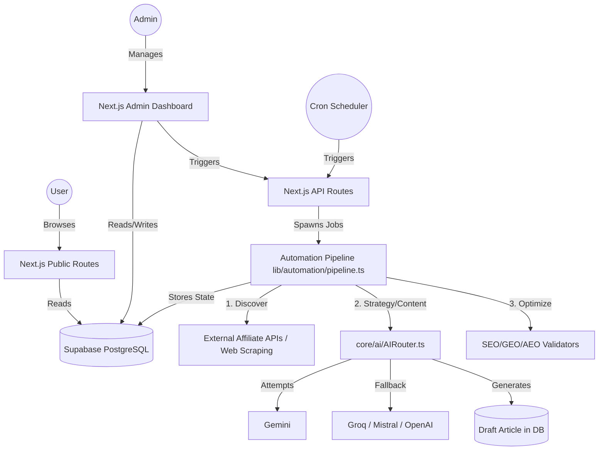

# 04 SYSTEM ARCHITECTURE

## High-Level Concept
ViaFinds operates as a dual-sided system: a public-facing Next.js editorial frontend, and a backend Automation Engine powered by diverse AI providers. 

## Architectural Diagram (Conceptual)

## Core Subsystems
1. **The Database Layer (Source of Truth)**:
   - Supabase PostgreSQL manages relational data (`articles`, `categories`, `products`, `automation_jobs`).
   - Uses Row Level Security (RLS) allowing public read access to `status = 'published'` articles, protecting drafts and admin data.
   - `pg` driver is used heavily for server-side direct queries.

2. **The Automation Pipeline**:
   - Resides in `lib/automation/pipeline.ts`.
   - Uses an `idempotency_key` based job queuing system (`automation_jobs` table).
   - Can run in fully automated mode (trend discovery) or manual mode (admin provides an affiliate URL).
   - Employs a robust retry and error trapping mechanism.

3. **The AI Router (Failover Mechanism)**:
   - Resides in `core/ai/AIRouter.ts`.
   - Implements a strict priority sequence (Gemini -> Groq -> Mistral -> OpenRouter -> OpenAI, etc).
   - If a provider throws a rate limit or server error, it transparently rolls over to the next provider.
   - Outputs are strictly validated as JSON via `safeParseJson`.

4. **The Agentic Framework (Emerging)**:
   - A move towards true agents is visible in `agents/core/BaseAgent.ts`.
   - Currently, agents are wrapped around specific AI prompt executions (e.g., `ContentIntelligenceAgent` enforces editorial guidelines).
   - The current architecture is mostly *procedural* (Pipeline calls AI directly or via simple agent wrappers), rather than *autonomous* (Agents deciding what pipeline steps to run).

## Deployment Architecture
- **Host**: Vercel (indicated by `vercel.json` and `.env` properties).
- **Data**: Supabase (Database + Storage).
- **Background Jobs**: Handled via Vercel cron triggering specific `/api/cron` endpoints, which advance the state machine in `pipeline.ts`.
