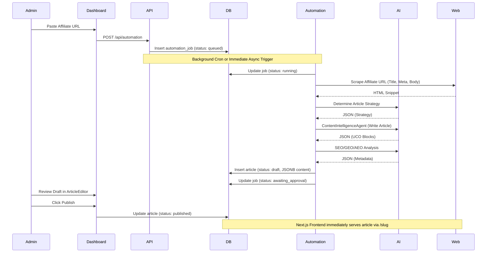

# 24 DATA FLOW

## The Article Lifecycle (Discovery to Publish)

## Failure Recovery Data Flow
1. **AI Failure**: If the AI returns malformed JSON, `cleanJsonResponse` attempts regex cleanup.
2. **Provider Failure**: If Gemini times out, `AIRouter` catches the error, logs it, and immediately requests Groq with the exact same prompt.
3. **Pipeline Failure**: If all providers fail or web scraping fails, the job transitions to `status: failed`.
4. **Admin Intervention**: Admin sees failed job in `/dashboard/jobs`, fixes the issue (e.g., bad URL), and clicks "Retry", setting status back to `queued`.
