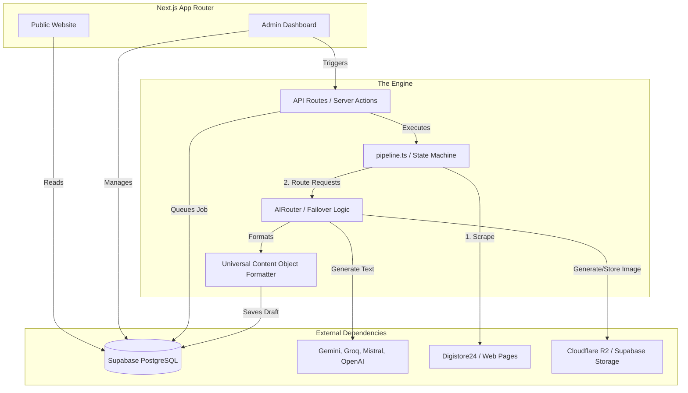

# 44 FINAL SYSTEM MAP

## The Current State of ViaFinds AI OS

### Assessment
ViaFinds is a highly capable, procedurally automated content pipeline. It is not yet a cognitive "Brain", but it possesses all the required limbs (execution tools, resilient AI routing, and robust database schemas) to become one. The transition to an AI Brain is largely an exercise in adding a cognitive planning layer above the existing `pipeline.ts`.
